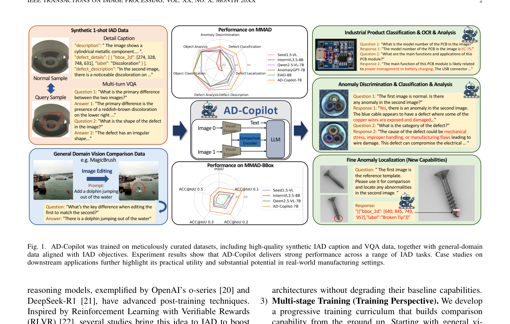
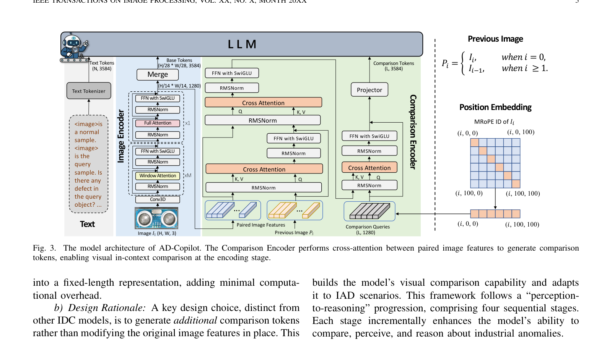

# AD-Copilot: A Vision-Language Assistant for Industrial Anomaly Detection via Visual In-context Comparison

<p align="center">
  <a href="https://arxiv.org/abs/2603.13779"></a>
  <a href="https://huggingface.co/jiang-cc/AD-Copilot"></a>
  <a href="https://huggingface.co/spaces/jiang-cc/AD-Copilot"></a>
  <a href="#license"></a>
</p>

<p align="center">
  <strong>Xi Jiang</strong>, Yue Guo, Jian Li, Yong Liu, Bin-Bin Gao, Hanqiu Deng, Jun Liu, Heng Zhao, Chengjie Wang, Feng Zheng
</p>

<p align="center">
  <em>Southern University of Science and Technology &nbsp;|&nbsp; Macau University of Science and Technology &nbsp;|&nbsp; Tencent YouTu Lab &nbsp;|&nbsp; A*STAR</em>
</p>

<p align="center">
  
</p>

## Abstract

Multimodal Large Language Models (MLLMs) have achieved impressive success in natural visual understanding, yet they consistently underperform in industrial anomaly detection (IAD). This is because MLLMs trained mostly on general web data differ significantly from industrial images. Moreover, they encode each image independently and can only compare images in the language space, making them insensitive to subtle visual differences that are key to IAD. To tackle these issues, we present **AD-Copilot**, an interactive MLLM specialized for IAD via **visual in-context comparison**. We first design a novel data curation pipeline to mine inspection knowledge from sparsely labeled industrial images, yielding a large-scale multimodal dataset **Chat-AD** (620k+ samples, 327 categories). AD-Copilot incorporates a novel **Comparison Encoder** that employs cross-attention between paired image features to enhance multi-image fine-grained perception, and is trained with a multi-stage strategy that incorporates domain knowledge and gradually enhances IAD skills. We also introduce **MMAD-BBox**, an extended benchmark for anomaly localization with bounding-box evaluation.

**AD-Copilot achieves 82.3% accuracy on the MMAD benchmark**, outperforming all proprietary and open-source models (including GPT-4o, Gemini 1.5 Pro) without any data leakage, and surpasses ordinary human performance on several IAD tasks.

## News

- **[2026-04]** Online demo available: [HuggingFace Space](https://huggingface.co/spaces/jiang-cc/AD-Copilot)
- **[2026-03]** Paper released on arXiv: [arXiv:2603.13779](https://arxiv.org/abs/2603.13779)
- **[2026-03]** Model weights released on HuggingFace
- **[Coming Soon]** Chat-AD dataset and MMAD-BBox benchmark

## Architecture

<p align="center">
  
</p>

The **Comparison Encoder** performs cross-attention between paired image features to generate comparison tokens, enabling visual in-context comparison at the encoding stage. This design preserves original image representations while producing compact comparison tokens for downstream reasoning.

## Models

| Model | Size | Backbone | Description | Link |
|-------|------|----------|-------------|------|
| AD-Copilot | 7B | Qwen2.5-VL-7B | Base model for anomaly detection | [jiang-cc/AD-Copilot](https://huggingface.co/jiang-cc/AD-Copilot) |
| AD-Copilot-Thinking | 7B | Qwen2.5-VL-7B | Thinking variant with chain-of-thought reasoning | [jiang-cc/AD-Copilot-Thinking](https://huggingface.co/jiang-cc/AD-Copilot-Thinking) |

## Results

### MMAD Benchmark (1-shot)

| Model | Scale | Anomaly Disc. | Defect Cls. | Defect Loc. | Defect Desc. | Defect Ana. | Object Cls. | Object Ana. | Average |
|-------|-------|:---:|:---:|:---:|:---:|:---:|:---:|:---:|:---:|
| Human (expert) | - | 95.24 | 75.00 | 92.31 | 83.33 | 94.20 | 86.11 | 80.37 | 86.65 |
| GPT-4o | - | 68.63 | 65.80 | 55.62 | 73.21 | 83.41 | 94.98 | 82.80 | 74.92 |
| Qwen2.5-VL | 7B | 71.10 | 56.02 | 60.69 | 64.13 | 78.26 | 91.49 | 83.67 | 72.19 |
| **AD-Copilot** | **7B** | **73.64** | **67.89** | **64.08** | **80.60** | **85.91** | **91.06** | **87.78** | **78.71** |
| **AD-Copilot-Thinking** | **7B** | **73.95** | **74.29** | **76.40** | **84.92** | **86.93** | **91.86** | **87.67** | **82.29** |

### MMAD-BBox Benchmark (1-shot)

| Model | Scale | mIoU (%) | ACC@IoU 0.1 | ACC@IoU 0.3 | ACC@IoU 0.5 |
|-------|-------|:---:|:---:|:---:|:---:|
| Qwen2.5-VL | 7B | 10.47 | 28.39 | 18.83 | 13.39 |
| **AD-Copilot** | **7B** | **24.46** | **55.66** | **43.77** | **34.78** |
| **AD-Copilot-Thinking** | **7B** | **25.30** | **55.22** | **44.76** | **35.88** |

## Installation

```bash
# Clone the repository
git clone https://github.com/jam-cc/AD-Copilot.git
cd AD-Copilot

# Create conda environment
conda create -n ad-copilot python=3.10 -y
conda activate ad-copilot

# Install dependencies
pip install -r requirements.txt
```

## Quick Start

### Inference

```python
import torch
from transformers import AutoModelForImageTextToText, AutoProcessor
from qwen_vl_utils import process_vision_info
from PIL import Image

model_path = "jiang-cc/AD-Copilot"

processor = AutoProcessor.from_pretrained(
    model_path,
    min_pixels=64 * 28 * 28,
    max_pixels=1280 * 28 * 28,
    trust_remote_code=True,
)

model = AutoModelForImageTextToText.from_pretrained(
    model_path,
    torch_dtype=torch.bfloat16,
    attn_implementation="flash_attention_2",
    device_map="auto",
    trust_remote_code=True,
).eval()

# Load images
good_image = Image.open("path/to/good_image.png")
test_image = Image.open("path/to/test_image.png")

# Build messages
messages = [
    {
        "role": "user",
        "content": [
            {"type": "image", "image": good_image},
            {"type": "image", "image": test_image},
            {"type": "text", "text": "The first image is a normal sample. "
             "Is there any anomaly in the second image? A. Yes B. No. "
             "Please answer the letter only."},
        ],
    }
]

# Run inference
text = processor.apply_chat_template(
    messages, tokenize=False, add_generation_prompt=True
)
image_inputs, video_inputs = process_vision_info(messages)
inputs = processor(
    text=[text], images=image_inputs, videos=video_inputs,
    padding=True, return_tensors="pt",
).to(model.device)

generated_ids = model.generate(**inputs, max_new_tokens=128, do_sample=False)
generated_ids_trimmed = [
    out[len(inp):] for inp, out in zip(inputs.input_ids, generated_ids)
]
output = processor.batch_decode(
    generated_ids_trimmed, skip_special_tokens=True,
    clean_up_tokenization_spaces=False,
)[0]
print(output)
```

### Command-Line Inference

```bash
# Basic inference
python scripts/inference.py \
    --model_path jiang-cc/AD-Copilot \
    --good_image path/to/good.png \
    --bad_image path/to/test.png

# With custom prompt
python scripts/inference.py \
    --model_path jiang-cc/AD-Copilot \
    --good_image path/to/good.png \
    --bad_image path/to/test.png \
    --prompt "The first image is a normal sample. Please describe the anomaly in the second image." \
    --max_new_tokens 256

# Benchmark mode (latency + throughput)
python scripts/inference.py \
    --model_path jiang-cc/AD-Copilot \
    --good_image path/to/good.png \
    --bad_image path/to/test.png \
    --benchmark
```

### Supported Tasks

| Task | Example Prompt |
|------|---------------|
| Anomaly Discrimination | `The first image is a normal sample. Is there any anomaly in the second image? A. Yes B. No.` |
| Defect Classification | `The first image is a normal sample. What is the type of defect? A. Contamination B. Broken C. Scratch D. No defect.` |
| Defect Description | `The first image is a normal sample. Please describe the anomaly in the second image in detail.` |
| Defect Localization | `The first image is a normal sample. Please locate the defects within the second image with bounding box in JSON format.` |

## Evaluation

```bash
# Run evaluation on MMAD benchmark
python scripts/evaluate_mmad.py \
    --model_path jiang-cc/AD-Copilot \
    --data_root /path/to/MMAD/dataset \
    --output_dir results/
```

See [scripts/](scripts/) for more details.

## Environment

Key dependencies (see `requirements.txt` for full list):

| Package | Version |
|---------|---------|
| torch | >= 2.4.0 |
| transformers | == 4.57.3 |
| flash-attn | >= 2.7.0 (recommended) |
| accelerate | >= 0.30.0 |
| qwen_vl_utils | latest |

> **Note:** `flash-attn` significantly speeds up inference but requires CUDA dev tools to compile. If unavailable, the model falls back to SDPA attention automatically.

## Demo

Try AD-Copilot online: **[HuggingFace Space](https://huggingface.co/spaces/jiang-cc/AD-Copilot)**

The demo supports:
- Comparison-based anomaly detection (reference + test image)
- Single-image tasks (object counting, OCR)
- Automatic bounding box visualization

## License

This project is released under the [Apache 2.0 License](LICENSE).

## Citation

If you find this work useful, please cite our paper:

```bibtex
@article{jiang2026adcopilot,
  title   = {AD-Copilot: A Vision-Language Assistant for Industrial Anomaly
             Detection via Visual In-context Comparison},
  author  = {Jiang, Xi and Guo, Yue and Li, Jian and Liu, Yong and
             Gao, Bin-Bin and Deng, Hanqiu and Liu, Jun and Zhao, Heng
             and Wang, Chengjie and Zheng, Feng},
  journal = {arXiv preprint arXiv:2603.13779},
  year    = {2026}
}
```

## Acknowledgements

AD-Copilot is built upon [Qwen2.5-VL](https://github.com/QwenLM/Qwen2.5-VL). We thank the Qwen team for their excellent foundation model.
